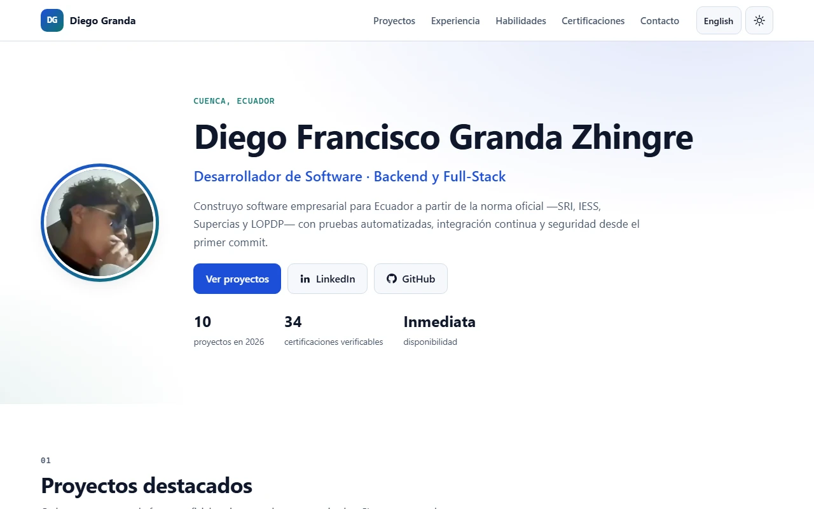
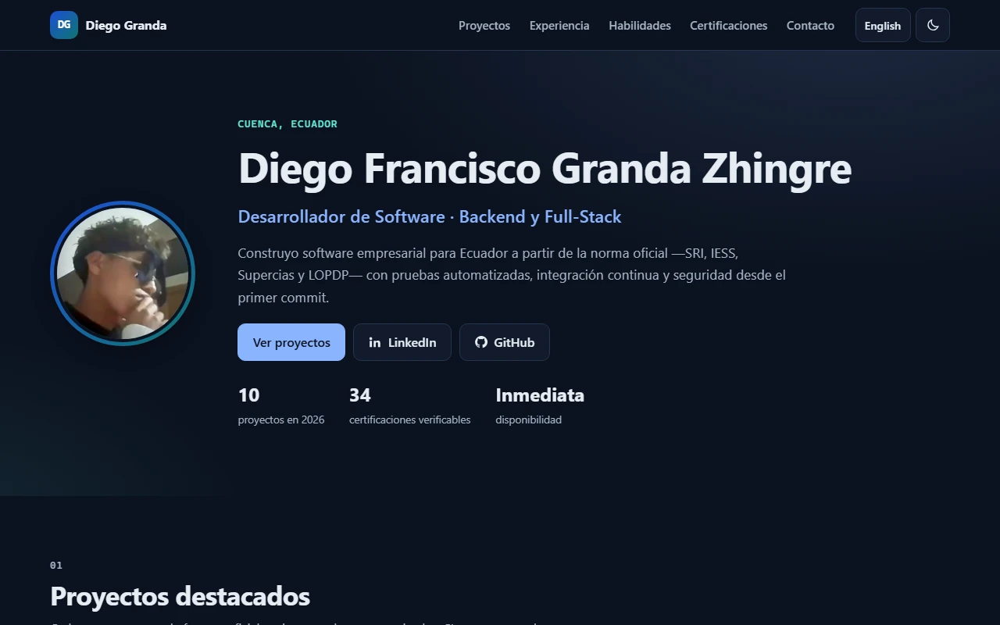
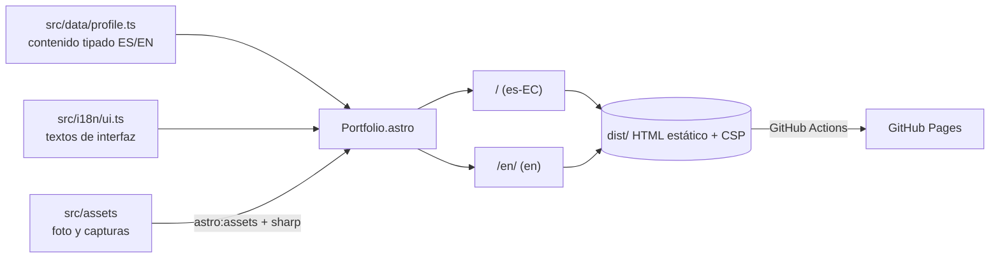
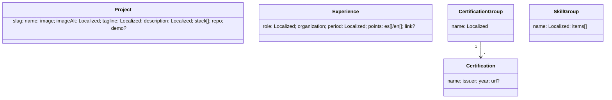

# Portafolio · Diego Francisco Granda Zhingre

Sitio personal para el CV: quién soy, mis 10 proyectos de 2026 con capturas y enlaces al código, experiencia, habilidades y 34 certificaciones verificables, en español e inglés.

[](https://github.com/DiegoFranciscoG/DiegoFranciscoG.github.io/actions/workflows/deploy.yml)


**Demo en vivo:** https://diegofranciscog.github.io/ · versión en inglés: https://diegofranciscog.github.io/en/ · No requiere usuario: es un sitio público de solo lectura.

<p>
  
  
</p>

## Problema que resuelve
Un CV en PDF no muestra el código ni el resultado de los proyectos. Este sitio da a un reclutador, en un solo enlace, el rol que busco, capturas de cada proyecto con su repositorio, la experiencia en RENAFIPSE y las certificaciones con su verificación oficial. Carga en menos de 1,5 s en un móvil y se ve bien al compartirlo en LinkedIn.

## Funcionalidades
- Dos idiomas (`/` en español y `/en/` en inglés) con `hreflang` recíproco.
- Tema claro u oscuro según el sistema, con botón que recuerda la elección.
- Tarjetas de proyecto con imágenes AVIF/WebP responsivas y texto alternativo en ambos idiomas.
- Vista previa para LinkedIn y otras redes (Open Graph 1200×630) y datos estructurados `Person`.
- `sitemap`, `robots.txt` y página 404 que no se indexa.
- Content Security Policy con hashes por página, sin recursos de terceros.

## Arquitectura


## Stack y por qué
| Capa | Tecnología | Motivo |
|---|---|---|
| Generador | Astro 7 | HTML estático sin JavaScript de framework en el cliente; Lighthouse 100 sin trucos. |
| Imágenes | `astro:assets` + sharp | AVIF/WebP con `srcset`, ancho y alto fijos (CLS 0). |
| Estilos | CSS propio con variables | Sin dependencias; tokens para tema claro y oscuro con contraste AA. |
| Tipos | TypeScript 6 + `astro check` | El contenido es un objeto tipado: faltar una traducción rompe el build. |
| Tests | Vitest + linkedom | Valida datos, paridad de idiomas y el HTML compilado. |
| Calidad | Lighthouse CI | El build falla si accesibilidad, buenas prácticas o SEO bajan de 100. |
| Despliegue | GitHub Actions + Pages | Gratis, con el dominio `diegofranciscog.github.io`. |

## Modelo de datos
No hay base de datos: el contenido vive en [`src/data/profile.ts`](src/data/profile.ts).

`Localized` es `{ es: string; en: string }`. Las fuentes de los datos están en [docs/investigacion.md](docs/investigacion.md).

## Ejecutar en local
Requiere Node.js 22.12 o superior.
```bash
npm ci
npm run dev        # http://localhost:4321
npm run verify     # astro check + build + tests
npm run preview    # sirve dist/ como en producción
```
No usa Docker: es un sitio estático y `npm run preview` reproduce producción.

## Variables de entorno
Ninguna. El sitio no tiene secretos ni llama a APIs.

## API
No expone API: todo es HTML estático.

## Tests y calidad
| Suite | Qué comprueba |
|---|---|
| `tests/data.test.ts` | Slugs únicos, textos completos en ambos idiomas, imágenes 16:10, enlaces https, prácticas en RENAFIPSE, certificaciones sin duplicados. |
| `tests/i18n.test.ts` | Mismas claves de interfaz en español e inglés, rutas y utilidades de URL. |
| `tests/build.test.ts` | Sobre `dist/`: un `h1`, `lang`, título y descripción, canonical, `hreflang`, Open Graph, JSON-LD, `alt` y dimensiones en cada imagen, cada script y estilo cubierto por la CSP, anclas válidas, sitemap y 404 sin indexar. |

59 tests en verde. Lighthouse 13.5 en local (móvil y escritorio, ambos idiomas): **100 en rendimiento, accesibilidad, buenas prácticas y SEO**; LCP 1,2 s en móvil, TBT 0 ms, CLS 0, 141 KiB. En CI, Lighthouse CI exige 100 en accesibilidad, buenas prácticas y SEO y al menos 90 en rendimiento (los runners compartidos varían).

## Despliegue
[`.github/workflows/deploy.yml`](.github/workflows/deploy.yml): gitleaks → `npm ci` → `astro check` + build → tests → Lighthouse CI → `upload-pages-artifact` → `deploy-pages`. En pull requests solo valida, no publica. Requiere **Settings → Pages → Source: GitHub Actions**.

## Seguridad aplicada
- CSP por página con `default-src 'self'`, `object-src 'none'`, `form-action 'none'`, `base-uri 'self'` y hashes SHA-256 de cada script y estilo en línea.
- Cero recursos de terceros, cero cookies y cero rastreadores.
- Foto sin metadatos EXIF ni GPS; sin correo ni teléfono publicados.
- Acciones fijadas por SHA, `permissions` mínimos, gitleaks en cada push y Dependabot.

## Decisiones técnicas
- **Astro en vez de Angular:** para un sitio de contenido, Astro entrega HTML sin JavaScript de framework; Angular añadiría un bundle que no aporta nada aquí.
- **CSP en `<meta>`:** GitHub Pages no permite cabeceras HTTP propias; Astro calcula los hashes y el script del tema se hashea desde el mismo archivo que se inyecta, así nunca se desincroniza.
- **Contacto por LinkedIn:** publicar correo y teléfono en una web abierta atrae spam; LinkedIn ya es el canal de los reclutadores.
- **Datos en TypeScript, no en JSON:** el compilador obliga a que cada texto exista en ambos idiomas.

## Roadmap
- [ ] Página por proyecto con arquitectura y decisiones técnicas.
- [ ] CV en PDF descargable sin datos de contacto sensibles.
- [ ] Enlaces a las demos en vivo cuando se desplieguen los proyectos.

## Fuentes de datos y licencias
- Capturas de pantalla: de mis propios repositorios, licencia MIT.
- Certificaciones: enlaces a la verificación oficial de cada emisor.
- Código: licencia [MIT](LICENSE).

## Autor
**Diego Francisco Granda Zhingre** · [GitHub](https://github.com/DiegoFranciscoG) · [LinkedIn](https://www.linkedin.com/in/diego-francisco-g-61b793254/)
